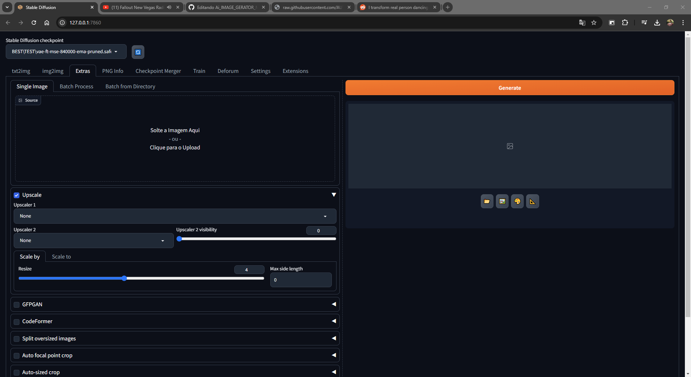

## Ai_IMAGE_GERATOR_MAKE

- Lista de links para rodar o stable difusion uteis 
- Modelo de ai e uma aula sobre os modelos: https://huggingface.co/WarriorMama777/OrangeMixs#abyssorangemix2-aom2
- Site para pegar modelos e AI: https://huggingface.co/datasets?format=format:audiofolder&sort=trending
- Mais uma aula sobre AI e modelos é bom aprender: https://huggingface.co/stabilityai/stable-diffusion-3-medium
- Site japa para Aprender AI tem vairoe exemplos é tipo uma wikipedia de verdade sobre AI e modedlos funcionais: https://seesaawiki.jp/nai_ch/d/TextualInversion
- Site para aprender sobre os movimentos realizados pela camer: https://dreamingcomputers.com/deforum-stable-diffusion/deforum-stable-diffusion-settings/
- Video ensinando a fazer danca e outros attributos: https://www.youtube.com/watch?v=sVmi2Yp43c0
- Interpolacao de imagem mais a frente é bom dar uma lida: https://huggingface.co/learn/cookbook/en/stable_diffusion_interpolation
- Uma musica boa se quiser usar nos videos é aquela a mais conhecida kssk: https://www.youtube.com/watch?v=G-t1O4n2tII
- O google tradutor é seu melhor aliado ksks: https://translate.google.com/?hl=pt-BR&tab=wT&sl=pt&tl=en&op=translate
- Se nao tem 24gb de ram e uma placa de video boa RTX ou AMD nem compensa 3 dias para gerar uma imagem: https://www.quora.com/Why-do-we-need-24-GB-VRAM

## SUA AI OU SUA INTERFACE DE INTERAÇAO COM OS MODELOS (RECOMENDO): https://github.com/AUTOMATIC1111/stable-diffusion-webui
- LEIA o RADME PARA FAZER A INSTALAÇÃO: https://github.com/AUTOMATIC1111/stable-diffusion-webui/blob/master/README.md
- LISTA de varias AI é seus criadores prompt melhor pior treinamento etc: https://huggingface.co/datasets/thefcraft/civitai-stable-diffusion-337k/viewer?row=93

## MODELS:
- Site com modelos de AI para baixar olhar ficar animado e usar muito divertido (faz conta): https://civitai.com/models/486610/artifys-realistic-alien-concept-lora
- Um bom modelo de ai para 3d personagem: https://civitai.com/models/742211/flux-3d-render-style

  
## TOOLS
- UM BOM TUTORIAL DE AI DE VERDADE: https://www.youtube.com/watch?v=kmT-z2lqEPQ
- Ferramenta para criar prompts e configuracoes nao usei muito ma é boa: https://sd-parseq.web.app/?docId=doc-6d9dd965-1157-4004-8adb-85d2bd87d27c
  
- Ferramenta para SFW/promps uma ai para gerar prompts é util : https://huggingface.co/spaces/thefcraft/prompt-generator-stable-diffusion
- Ferramenta que verifica e formata JSON file é mais a frrente vc vai usar: https://odu.github.io/slingjsonlint/
- O chat GPT é bom usar pois uma ai para te explicar sobra AI faz muito sentido: https://chatgpt.com/
- Moviemntos como esse: https://www.reddit.com/r/StableDiffusion/comments/12i9qr7/i_transform_real_person_dancing_to_animation/
- Site para consegur prompts e ideias : https://majinai.art/ja/index.php

## EXEMPLO
- exemplo de uso de um cara que conheço (IMAGEM +18): https://www.reddit.com/r/XLIKE/hot/
